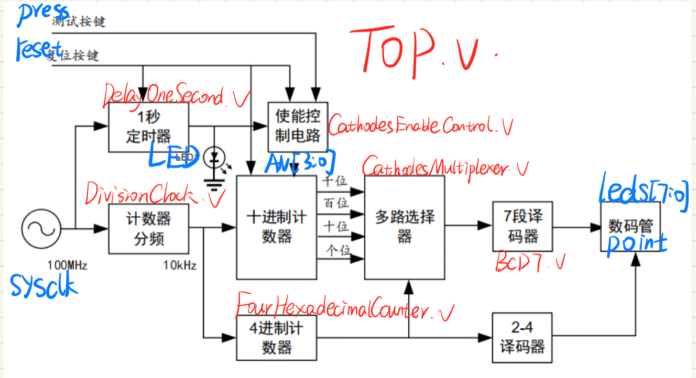
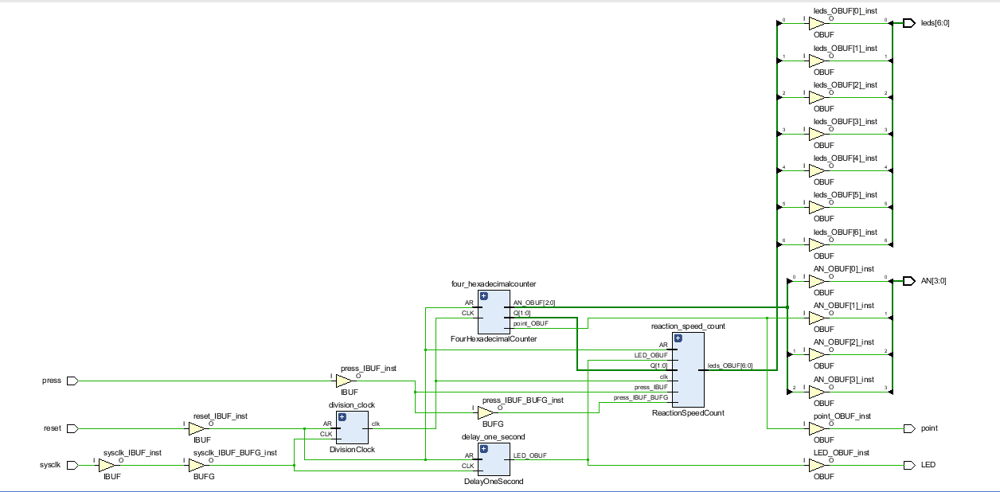
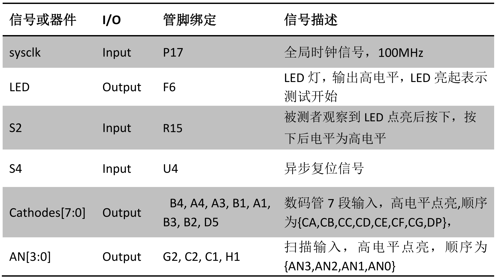
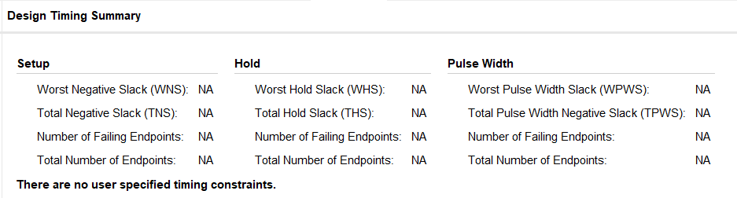
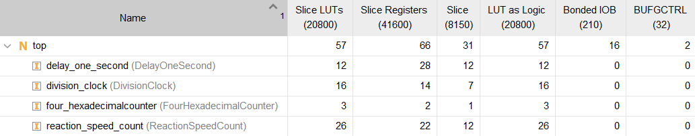

<iframe src='https://raw.githubusercontent.com/TX-Leo/TX-Leo.github.io/main/_posts/2022-07-28-实验二-反应速度测试仪实验报告/file/实验二-反应速度测试仪实验报告_f3Z-YZMXi1.pdf' frameborder='0' scrolling='no'>
<video src="https://raw.githubusercontent.com/TX-Leo/TX-Leo.github.io/main/_posts/2022-07-28-实验二-反应速度测试仪实验报告/video/a51e92daa3c4c876d1a4bd389f6ed8fd_KK2rIDJWo1.mp4" width="40%">


# 实验二-反应速度测试仪实验报告

> 📌王治       无03       2020010699

[实验二-反应速度测试仪实验报告.pdf](file/实验二-反应速度测试仪实验报告_f3Z-YZMXi1.pdf)

[Experiment\_02\_ReactionSpeedTester.zip](file/Experiment_02_ReactionSpeedTester__eSkLRyRin.zip)

# 一、实验目的

> 📌反应速度测试仪可以测量人体对信号的反应时间，用于为判断疲劳程度或相关医学诊断作为参考。

***

# 二、实验要求

*   （1） 系统复位后，延时 1 秒，点亮某 LED，被测试者观察到 LED 点亮后，立即按动按钮 S2。电路测量自 LED 亮起到按钮按下之间的时间差，并显示在数码管上，按按钮 S4 后，系统复位，并重复上述测试过程。

*   （2） 采用全同步设计，即电路中所有触发器的时钟均为系统时钟。

*   （3） 采用 4 位七段数码管显示，量程为 0.0ms\~999.9ms。

*   （4） 报告中给出占用逻辑资源和时序性能。

*   （5） 输入输出及管脚绑定

***

# 三、设计方案

## 1.模块化设计

*   计数器分频DivisionClock

*   1s定时器DelayOneSecond

*   使能控制电路CathodesEnableControl

*   反应速度计时器ReactionSpeedCount

*   多路选择器CathodesMultiplexer

*   4进制计数器FourHexadecimalCounter

*   7段译码器BCD7





***

## 2.信号或器件-约束文件XDC

```verilog
#System Clock
set_property -dict {PACKAGE_PIN P17 IOSTANDARD LVCMOS33} [get_ports {sysclk}]
#Reset
set_property -dict {PACKAGE_PIN U4 IOSTANDARD LVCMOS33} [get_ports {reset}]
#Press Input
set_property -dict {PACKAGE_PIN R15 IOSTANDARD LVCMOS33} [get_ports {press}]
#Led
set_property -dict {PACKAGE_PIN F6 IOSTANDARD LVCMOS33} [get_ports {LED}]
#Enable the 4-bit Cathodes
set_property -dict {PACKAGE_PIN H1 IOSTANDARD LVCMOS33} [get_ports {AN[0]}]
set_property -dict {PACKAGE_PIN C1 IOSTANDARD LVCMOS33} [get_ports {AN[1]}]
set_property -dict {PACKAGE_PIN C2 IOSTANDARD LVCMOS33} [get_ports {AN[2]}]
set_property -dict {PACKAGE_PIN G2 IOSTANDARD LVCMOS33} [get_ports {AN[3]}]
#Cathodes
set_property -dict {PACKAGE_PIN B4 IOSTANDARD LVCMOS33} [get_ports {leds[0]}]
set_property -dict {PACKAGE_PIN A4 IOSTANDARD LVCMOS33} [get_ports {leds[1]}]
set_property -dict {PACKAGE_PIN A3 IOSTANDARD LVCMOS33} [get_ports {leds[2]}]
set_property -dict {PACKAGE_PIN B1 IOSTANDARD LVCMOS33} [get_ports {leds[3]}]
set_property -dict {PACKAGE_PIN A1 IOSTANDARD LVCMOS33} [get_ports {leds[4]}]
set_property -dict {PACKAGE_PIN B3 IOSTANDARD LVCMOS33} [get_ports {leds[5]}]
set_property -dict {PACKAGE_PIN B2 IOSTANDARD LVCMOS33} [get_ports {leds[6]}]
#Decimal Point
set_property -dict {PACKAGE_PIN D5 IOSTANDARD LVCMOS33} [get_ports {point}]
#For Debug
set_property CLOCK_DEDICATED_ROUTE FALSE [get_nets {press_IBUF}]
```



***

### 1）输入

*   系统时钟sysclk

*   复位信号reset

*   按键输入press

***

### 2）输出

*   LED灯LED

*   7段数码管leds\[6:0]

*   小数点point

*   4个数码管使能AN\[3:0]

***

# 四、关键代码

## 1.top.v

```verilog
///////////////////////////////////////////////
// Author:TX-Leo
// Target Devices: XILINX xc7A35TCSG324-1
// Tool Versions: Vivado 2019.2
// Create Date: 2022/04/25
// Project Name: ReactionSpeedTester
// Description: It's TX-Leo's Experiment_02
// Module Name: Top
// Function:
// （1） 系统复位后，延时 1 秒，点亮某 LED，被测试者观察到 LED 点亮后，立即按动按钮 S2。电路测量自 LED 亮起到按钮按下之间的时间差，并显示在数码管上，按按钮 S4 后，系统复位，并重复上述测试过程。
// （2） 采用全同步设计，即电路中所有触发器的时钟均为系统时钟。
// （3） 采用 4 位七段数码管显示，量程为 0.0ms~999.9ms。
// （4） 报告中给出占用逻辑资源和时序性能。
// （5） 输入输出及管脚绑定
//////////////////////////////////////////////

`timescale 1ns / 1ps

module top(input sysclk,      //系统时钟
           input reset,       //复位
           input press,       //按键输入
           output LED,        //LED显示
           output [3:0] AN,   //数码管使�??
           output [6:0] leds, //7段数码管
           output point);
    
    wire division_clk;//分频时钟
    wire start_flag;//是否测试开始的标志
    wire [3:0] number0,number1,number2,number3;//四位数码管要显示的数字
    wire [1:0] cnt;//四进制计数器
    wire [3:0] number;//要显示的数字
    assign LED = start_flag;//LED的亮与灭
    //忽略vscode里的报错（到vivado里没有错误）
    DivisionClock division_clock (.sysclk(sysclk),.reset(reset),.division_clk(division_clk));//输出clk(10kHZ)
    DelayOneSecond delay_one_second (.sysclk(sysclk),.reset(reset),.start_flag(start_flag));//1秒电路，输出start，1s后start为0
    ReactionSpeedCount reaction_speed_count (.clk(division_clk),.reset(reset),.start_flag(start_flag),.press(press),.number0(number0),.number1(number1),.number2(number2),.number3(number3));//测试开始计时（1khz），输出实时每位应该显示的数字
    FourHexadecimalCounter four_hexadecimalcounter (.clk(division_clk),.reset(reset),.cnt(cnt));//四进制计数器 输出cnt
    CathodesEnableControl cathodes_enable_control (.cnt(cnt),.AN(AN),.point(point));//依据cnt 输出AN和point
    CathodesMultiplexer cathodes_multiplexer (.cnt(cnt),.number0(number0),.number1(number1),.number2(number2),.number3(number3),.number(number));//依据cnt 输出number（number0,1,2,3其中的一个）
    BCD7 bcd7 (number,leds);//out变成7段数码管
    
endmodule
```

## 2.计数器分频DivisionClock.v

```verilog
///////////////////////////////////////////////
// Author:TX-Leo
// Target Devices: XILINX xc7A35TCSG324-1
// Tool Versions: Vivado 2019.2
// Create Date: 2022/04/25
// Project Name: ReactionSpeedTester
// Description: It's TX-Leo's Experiment_02
// Module Name: DivisionClock
// Function: 100MH系统时钟实现10000倍分频为10kHZ
//////////////////////////////////////////////

`timescale 1ns / 1ps

module DivisionClock(input sysclk,//系统时钟
                     input reset,//复位
                     output division_clk//分频时钟
                    );

    reg division_clk;
    reg [12:0] cnt;//计数器（中间变量），用于分频

    always @(posedge reset or posedge sysclk) begin
        if(reset) begin
                cnt <= 13'd0;
                division_clk <= 0;
            end
        else begin
            if(cnt == 13'd4999) begin
                cnt <= 13'd0;
                division_clk <= ~division_clk;
                end
            else begin 
                cnt <= cnt + 1;
            end
        end
    end

endmodule

```

## 3.1s定时器DelayOneSecond.v

```verilog
///////////////////////////////////////////////
// Author:TX-Leo
// Target Devices: XILINX xc7A35TCSG324-1
// Tool Versions: Vivado 2019.2
// Create Date: 2022/04/25
// Project Name: ReactionSpeedTester
// Description: It's TX-Leo's Experiment_02
// Module Name: DivisionClock
// Function: cnt计数，数到100000000（100MHZ）则开始测试标志start_flag变为1
//////////////////////////////////////////////

`timescale 1ns / 1ps

module DelayOneSecond(input sysclk,//系统时钟
                      input reset,   //复位         
                      output start_flag//开始测试标志
                    );

    reg start_flag;
    reg [26:0] cnt;//计数（中间变量），数到100000000（100MHZ）则开始测试标志start_flag变为1
    /*若想自定义延时（精确到0.1s，0-10s）*/
    //举例：delay=({$random} % 100)/10;
    always @(posedge reset or posedge sysclk) begin
        if(reset) begin 
            cnt <= 27'd0;
            start_flag <= 0;
        end
        else begin
            if(cnt == 27'd99999999) begin
            start_flag <= 1;
            end
            else begin
                cnt <= cnt + 1;
            end
        end
    end

endmodule
```

## 4.反应速度计时器ReactionSpeedCount.v

```verilog
///////////////////////////////////////////////
// Author:TX-Leo
// Target Devices: XILINX xc7A35TCSG324-1
// Tool Versions: Vivado 2019.2
// Create Date: 2022/04/25
// Project Name: ReactionSpeedTester
// Description: It's TX-Leo's Experiment_02
// Module Name: ReactionSpeedCount
// Function: 1s后开始测试并计数，更新实时每位应该显示的数字，直到按键了
//////////////////////////////////////////////

`timescale 1ns / 1ps

module ReactionSpeedCount(input clk,//时钟
                          input reset,//复位
                          input start_flag,//开始测试标志
                          input press,//按键输入
                          output [3:0] number0,//输出实时每位应该显示的数字0
                          output [3:0] number1,//输出实时每位应该显示的数字1
                          output [3:0] number2,//输出实时每位应该显示的数字2
                          output [3:0] number3 //输出实时每位应该显示的数字3
                          );


    reg [3:0] number0,number1,number2,number3;
    reg c0,c1,c2;//是否有进位（中间变量）
    reg label;//是否按键了

    always @(posedge reset or posedge clk or posedge press) begin
        if(reset) begin
            number0 <= 4'd0;
            number1 <= 4'd0;
            number2 <= 4'd0;
            number3 <= 4'd0;
            c0 <= 0;
            c1 <= 0;
            c2 <= 0;
            label <= 0;
        end
        else begin
            if(press) begin 
                label <= 1;
            end
            /*若想在1s内按键了会继续进行测试，将上述一行改为：*/
            // if(press) begin
            //     if(start_flag==0) label <= 0;
            //     else label <= 1;
            // end
            else begin
                if((start_flag == 1)&&(label ==0)) begin
                    if(number0 == 4'd9) begin
                        number0 <= 4'd0;
                        c0 <= 1;
                    end
                    else begin
                        number0 <= number0 + 1;
                    end
                    if(c0 == 1) begin
                        if(number1 == 4'd9) begin
                            number1 <= 4'd0;
                            c1 <= 1;
                        end
                        else begin
                            number1 <= number1 + 1;
                        end
                        c0 <= 0;
                    end
                    if(c1 == 1) begin
                        if(number2 == 4'd9) begin
                            number2 <= 4'd0;
                            c2 <= 1;
                        end
                        else begin
                            number2 <= number2 + 1;
                        end
                        c1 <= 0;
                    end
                    if(c2 == 1) begin
                        if(number3 == 4'd9) begin
                            number3 <= 4'd0;
                        end
                        else begin 
                            number3 <= number3 + 1;
                        end
                        c2 <= 0;
                    end
                end
            end
        end
    end

endmodule

```

## 5.4进制计数器FourHexadecimalCounter.v

```verilog
///////////////////////////////////////////////
// Author:TX-Leo
// Target Devices: XILINX xc7A35TCSG324-1
// Tool Versions: Vivado 2019.2
// Create Date: 2022/04/25
// Project Name: ReactionSpeedTester
// Description: It's TX-Leo's Experiment_02
// Module Name: FourHexadecimalCounter
// Function: 4进制计数器cnt
//////////////////////////////////////////////

`timescale 1ns / 1ps

module FourHexadecimalCounter(input clk,//输入时钟
                              input reset,//复位
                              output [1:0] cnt//计数器
                             );

    reg [1:0] cnt;

    always @(posedge reset or posedge clk) begin
        if(reset) begin
            cnt <= 2'b00;
        end
        else begin
            if(cnt == 2'b11) begin
                cnt <= 2'b00;
            end
            else begin
                cnt <= cnt + 1;
            end
        end
    end

endmodule

```

## 6.使能控制电路CathodesEnableControl.v

```verilog
///////////////////////////////////////////////
// Author:TX-Leo
// Target Devices: XILINX xc7A35TCSG324-1
// Tool Versions: Vivado 2019.2
// Create Date: 2022/04/25
// Project Name: ReactionSpeedTester
// Description: It's TX-Leo's Experiment_02
// Module Name: CathodesEnableControl
// Function: 4进制计数器cnt
//////////////////////////////////////////////

`timescale 1ns / 1ps

module CathodesEnableControl(input [1:0] cnt,//4进制计数器
                             output [3:0] AN,//4个数码管使能
                             output point//小数点
                            );

    reg [3:0] AN;
    reg point;

    always @* begin
        case(cnt)
            2'b00: AN = 4'b0001;
            2'b01: AN = 4'b0010;
            2'b10: AN = 4'b0100;
            2'b11: AN = 4'b1000;
        endcase

        case(cnt)
            2'b00: point = 0;
            2'b01: point = 1;//开始亮起第二个数码管时显示小数点
            2'b10: point = 0;
            2'b11: point = 0;
        endcase
    end

endmodule

```

## 7.多路选择器CathodesMultiplexer.v

```verilog
///////////////////////////////////////////////
// Author:TX-Leo
// Target Devices: XILINX xc7A35TCSG324-1
// Tool Versions: Vivado 2019.2
// Create Date: 2022/04/25
// Project Name: ReactionSpeedTester
// Description: It's TX-Leo's Experiment_02
// Module Name: CathodesMultiplexer
// Function: 选择显示哪个数码管
//////////////////////////////////////////////

`timescale 1ns / 1ps

module CathodesMultiplexer (input [1:0] cnt,
                            input [3:0] number0,
                            input [3:0] number1,
                            input [3:0] number2,
                            input [3:0] number3,
                            output [3:0] number
                            );

    reg [3:0] number;

    always @* begin
        case(cnt)
            2'b00: number = number0;
            2'b01: number = number1;
            2'b10: number = number2;
            2'b11: number = number3;
        endcase
    end

endmodule

```

## 8.7段译码器BCD7.v

```verilog
///////////////////////////////////////////////
// Author:TX-Leo
// Target Devices: XILINX xc7A35TCSG324-1
// Tool Versions: Vivado 2019.2
// Create Date: 2022/04/25
// Project Name: ReactionSpeedTester
// Description: It's TX-Leo's Experiment_02
// Module Name: BCD7
// Function: 数码管显示数字
//////////////////////////////////////////////

`timescale 1ns / 1ps

module BCD7 (input [3:0] din,//输入数字
             output [6:0] dout//输出7段码
            );

    reg [6:0] dout;

    always @*begin
        case(din)
        4'h0: dout = 7'b0111111;
        4'h1: dout = 7'b0000110;
        4'h2: dout = 7'b1011011;
        4'h3: dout = 7'b1001111;
        4'h4: dout = 7'b1100110;
        4'h5: dout = 7'b1101101;
        4'h6: dout = 7'b1111101;
        4'h7: dout = 7'b0000111;
        4'h8: dout = 7'b1111111;
        4'h9: dout = 7'b1101111;
        default: dout = 7'b0;
        endcase
    end

endmodule
```

# 五、电路仿真

## 1.仿真文件tb\_top.v

```verilog
`timescale 1ns/1ps
module tb_top;
    parameter PERIOD = 10;
    reg sysclk = 0;
    reg reset = 0;
    reg press = 0;
    wire LED;
    wire [3:0] AN;
    wire [6:0] leds;
    wire point;
    initial begin
        forever begin
            #(PERIOD/2)
            sysclk = ~sysclk;
        end
    end
    initial begin
        sysclk = 1'b1;
        press = 1'b0;
        reset = 1'b0;
        #(100)
        reset = 1'b1;
        #(1)
        reset = 1'b0;
        #(19999)
        press = 1'b1;
        #(1)
        press = 1'b0;
        #(200)
        $finish;
    end

    top u_top(
    .sysclk(sysclk),
    .reset(reset),
    .press(press),

    .LED(LED),
    .AN(AN[3:0]),
    .leds(leds[6:0]),
    .point(point)
    );
endmodule
```

***

## 2.仿真效果

### 1）复位

> 📌100ns后复位一下，如图


***

### 2）按键

> 📌20100ns后按键，如图：


***

# 六、电路逻辑资源占用情况&时序性能分析

## 1.电路设计的逻辑资源占用情况



***

## 2.电路设计的时序性能分析



***

# 七、实验效果

[https://cloud.tsinghua.edu.cn/f/c716fcf3ee2c4d89abec/](https://cloud.tsinghua.edu.cn/f/c716fcf3ee2c4d89abec/ "https://cloud.tsinghua.edu.cn/f/c716fcf3ee2c4d89abec/")


***

# 八、小结

> 📌在此次实验中，我最大的收货就是模块化设计，懂得将一个复杂的电路分成有效且关键的几个模块后分布设计，然后再去组合实现其目标功能，以及对于电路的静态时序分析以及仿真的进行。

***

# 九、文件清单

*   Experiment\_02\_ReactionSpeedTester

    *   src

        *   top.v

            *   DivisionClock.v

            *   DelayOneSecond.v

            *   CathodesEnableControl.v

            *   ReactionSpeedCount.v

            *   CathodesMultiplexer.v

            *   FourHexadecimalCounter.v

            *   BCD7.v

    *   constrain

        *   constrain.xdc

    *   sim

        *   tb\_top.v
